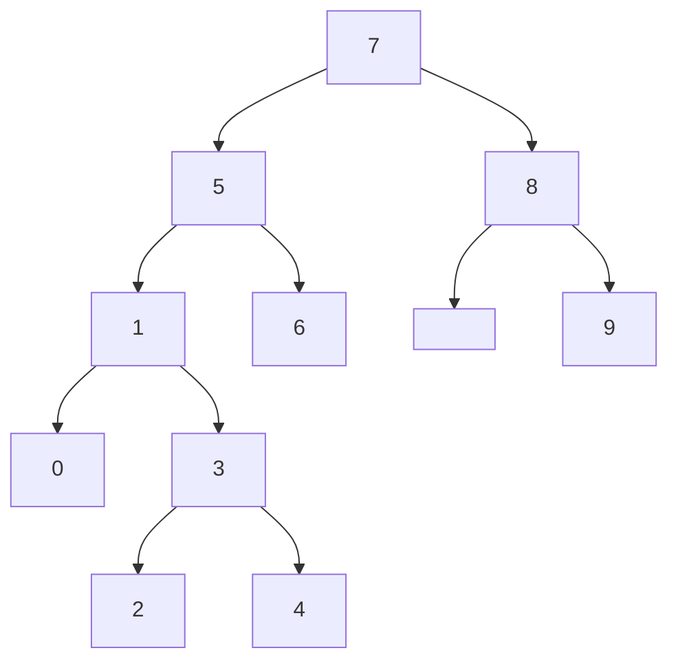

root=7

`1.`  5<7 $\Rightarrow$ 5, 7'nin soluna yazılır. \
`2.`  1<7, 1<5 $\Rightarrow$ 1, 5'in soluna yazılır. \
`3.`  8>7 $\Rightarrow$ 8, 7'nin sağına yazılır. \
`4.`  3<7, 3<5, 3>1 $\Rightarrow$ 3, 1'in sağına yazılır. \
`5.`  6<7, 6>5 $\Rightarrow$ 6, 5'in sağına yazılır.  \
`6.`  0<7, 0<5, 0<1 $\Rightarrow$ 0, 1'in soluna yazılır.  
`7.`  9>7, 9>8 $\Rightarrow$ 9, 8'in sağına yazılır. \
`8.`  4<5, 4>1, 4>3 $\Rightarrow$ 4, 3'ün sağına yazılır. \
`9.`  2<5, 2>1, 2>3 $\Rightarrow$ 2, 3'ün soluna yazılır. 

[Patika.dev](https://www.patika.dev/tr) 
